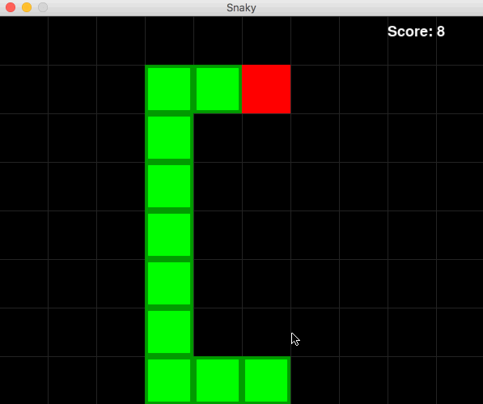
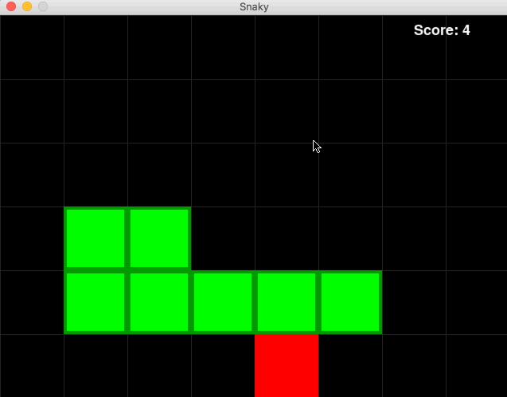
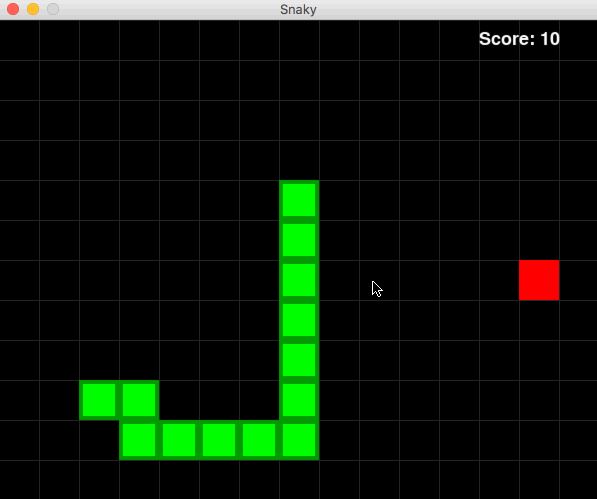

# Snaky

Snaky is a Snake game series including a basic one-player version and three versions of AI to play Snake automatically.

The project is implemented in Python.

**If you like it, Please give it a star, Thanks!**
### Require

You should have `pygame` module installed.

### Final Version Demo



## Usage

### Basic function - One player

In this version, you can control the movement of the snake to eat the apple to grow.

```bash
git clone https://github.com/memoiry/Snaky
cd Snaky
python snaky.py
```


It was actually manually controlled by myself(hard to control while recording the gif....so it's poor..)


### AI version 1 - Based on Hamiltonian path

A perfect strategy, ensuring filling the screen, but the speed is slow.

```bash
python snaky_ai_v1.py
```




### AI version 2 - Based on BFS

A simple BFS strategy make the snake trapped in local optimal point and not considering future.

```bash
python snaky_ai_v2.py
```




### AI version 3 - Based on BFS(shortest path), forward checking and follow the tail(longest path).

In this AI version. The algorithm is constructed as follow.

To find snake `S1`'s next moving direction `D`, the AI snake follows the steps below:

1. Compute the shortest path `P1` from snake `S1`'s head to the food. If `P1` exists, go to step 2. Otherwise, go to step 4.
2. Move a virtual snake `S2` (the same as `S1`) to eat the food along path `P1`.
3. Compute the longest path `P2` from snake `S2`'s head to its tail. If `P2` exists, let `D` be the first direction in path `P1`. Otherwise, go to step 4.
4. Compute the longest path `P3` from snake `S1`'s head to its tail. If `P3` exists, let D be the first direction in path `P3`. Otherwise, go to step 5.
5. Let `D` be the direction that makes the snake the farthest from the food.

```bash
python snaky_ai_v3.py
```


Enjoy!

## Reference

[AutomatedSnakeGameSolvers.pdf](http://sites.uci.edu/joana1/files/2016/12/AutomatedSnakeGameSolvers)

[Wormy](https://github.com/asweigart/making-games-with-python-and-pygame/blob/master/wormy/wormy.py)

